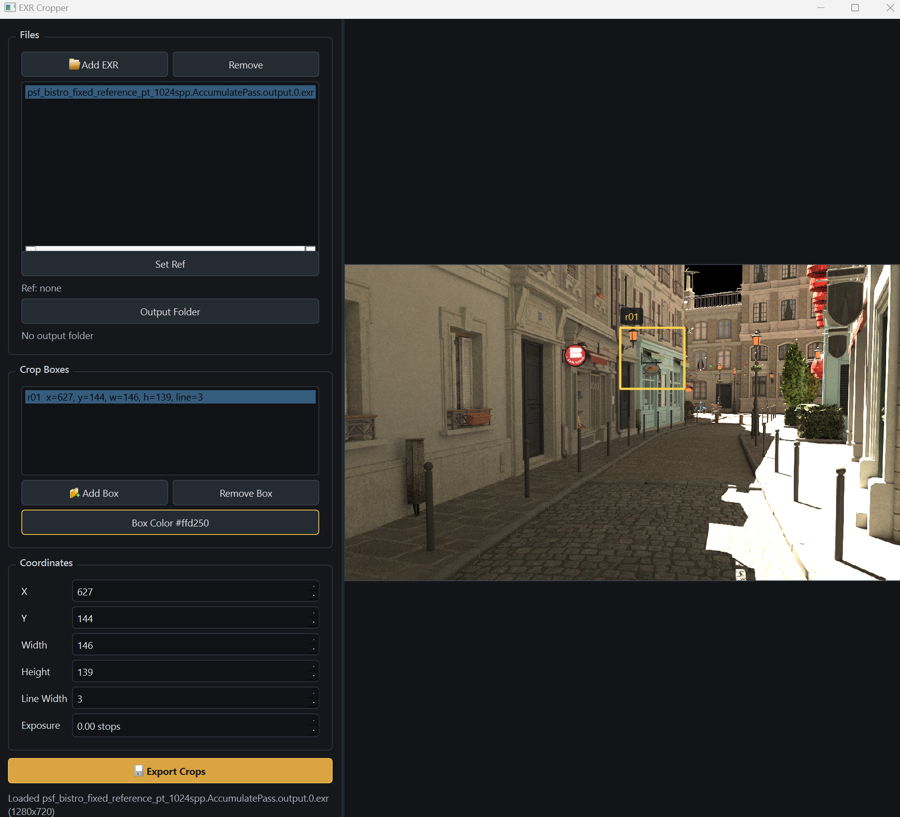
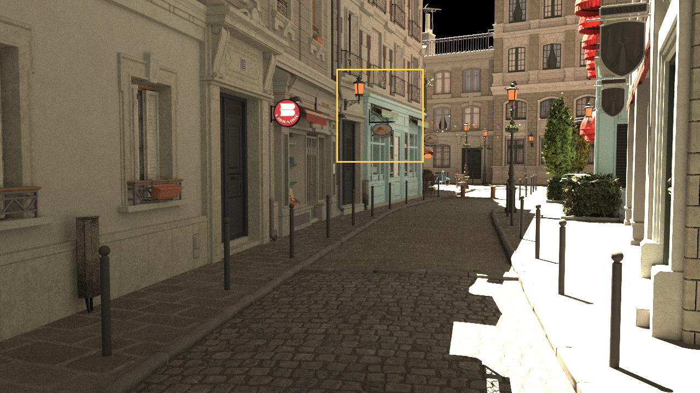

# EXR Cropper

EXR Cropper is a Python desktop app for extracting matching crop regions from OpenEXR images.

It is designed for rendering and path tracing comparison workflows where the same region needs to be cropped from multiple EXR outputs.

## Preview



## Sample Outputs

| Reference overlay | Path tracer crop | Reference crop |
| --- | --- | --- |
|  |  |  |

## Features

- Load multiple `.exr` / `.EXR` files.
- Select one reference image.
- Create multiple crop boxes.
- Set crop box color and line width per box.
- Export matching crops from all selected EXR files.
- Export a reference PNG with crop boxes drawn on top.

## Requirements

- Python 3.11
- Windows, macOS, or Linux with a working Qt/PySide6 environment

The app has been developed and tested on Windows 11. macOS and Linux should work from Python source if the required Python wheels and Qt display dependencies are available.

## Supported Files

Input:

- OpenEXR image files: `.exr`, `.EXR`
- RGB channels are required for preview and PNG export.
- Supported RGB channel names:
  - `R`, `G`, `B`
  - layered names such as `beauty.R`, `beauty.G`, `beauty.B`

Output:

- `.exr`: HDR crop output, written as float32 channels
- `.png`: crop image for quick viewing and presentation
- `.png`: reference overlay image with crop rectangles

Current limitations:

- The app reads the first image part from an EXR.
- All channels must be regular 2D image channels with the same resolution.
- Deep EXR, multi-part workflows, and subsampled channels are not supported.

## Installation

Create and activate a conda environment:

```powershell
conda create -n path python=3.11 pip
conda activate path
```

Install dependencies and the app:

```powershell
python -m pip install -r requirements.txt
python -m pip install -e .
```

If the `path` environment already exists but has no Python installed:

```powershell
conda install -n path -y python=3.11 pip
conda activate path
python -m pip install -r requirements.txt
python -m pip install -e .
```

## Run

Run from the repository root:

```powershell
conda activate path
python -m exr_cropper
```

After editable install, this also works:

```powershell
conda activate path
exr-cropper
```

## Basic Workflow

1. Click `Add EXR` and select one or more EXR files.
2. Select a file and click `Set Ref`.
3. Click `Add Box` or drag in the preview to create crop boxes.
4. Adjust coordinates, box color, line width, and exposure.
5. Click `Output Folder` and choose an export folder.
6. Click `Export Crops`.

`Export Crops` is enabled only after files, crop boxes, a reference file, and an output folder are selected.

## Output Naming

For an input named `scene.exr` and the first crop box at `x=10, y=20, width=128, height=96`, the app writes:

```text
scene_r01_x10_y20_w128_h96.exr
scene_r01_x10_y20_w128_h96.png
```

The selected reference file also writes a PNG visualization with crop rectangles:

```text
scene_regions_overlay.png
```

This is not a modified HDR EXR reference file. The app converts the Ref EXR to an 8-bit PNG using the current exposure setting, then draws the crop boxes on that PNG.

## Repository Contents

Files intended for source control:

```text
src/
screenshots/
pyproject.toml
requirements.txt
README.md
LICENSE
.gitignore
```

Local input files, output files, tests, packaging tools, and packaged executables are ignored by `.gitignore`.

## License

This project is released under the MIT License. See `LICENSE` for details.
